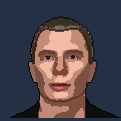

## Voievodskyi Maksym

#### Odessa, Ukraine

- Phone: +3(8050)572-87-11

* E-mail: maksimvoevodskij81@gmail.com

- Github: https://github.com/maksimvoevodskij81

* Linkedin: http://linkedin.com/in/maksim-voievodskyi-7675981a4

---

#### Skills :

##### Programming languages:

C++ /C#/Java Script/CSS/HTML
.NET(Framework)/WPF/Windows Forms/ADO.NET/Entity(Framework)

SOLID / Pattern Design
System programming/network programming
Structured query language (SQL/MS SQL Server/Management)

#### Experience :

- C ++ :
  https://github.com/maksimvoevodskij81

- C#/.NET/Windows Forms /WPF :  
  https://github.com/maksimvoevodskij81/C-Game_2048

- HTML / CSS /JS :  
  https://maksimvoevodskij81.github.io/portfolio/.

- system programming  
  https://github.com/maksimvoevodskij81/ThreadRun

#### Education :

STEP IT Academy Developer 2019- up to now
Web coder – web developer certificate of completion link  
Donetsk Law institute jurisprudence 2001-2007

#### Additional information :

- English - Upper intermediate;
- Russian - native.
- Ukrainian - fluently.
